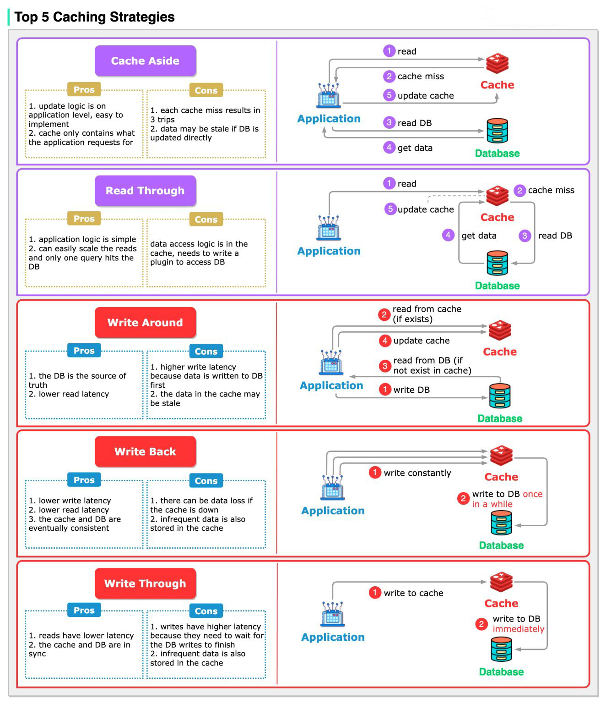

# Scale MyMCI Oracle DBs

The solution of optimizing Oracle DBs to reduce query fetch time (read mode).

## 1. Recognize Hot-Spots

-   **Use Oracle’s Built-In Monitoring Tools:** Utilize tools like Automatic Workload Repository (AWR) and Active Session History (ASH) to capture detailed performance data. These tools help you see which queries are the most resource-intensive and how often certain queries are executed.

-   **Query Execution Statistics:** Monitor views such as `SQL Queries` to identify SQL statements with high execution counts or long cumulative execution times.

-   **Oracle Enterprise Manager (OEM):** If available, **OEM** provides a graphical and historical analysis of system performance. It can automatically highlight SQL statements and database objects that are consistently under heavy read load.

-   **Dashboard Query Logs:** For environments where tools like Metabase interface with the database, analyze the queries generated by your dashboard. Identify patterns where the same heavy queries are executed repeatedly.

## 2. Database Indexing

Database indexing in Oracle is a powerful tool to enhance query performance by minimizing unnecessary full table scans.

An index in Oracle is similar to an index in a book—it provides pointers that help locate specific data quickly. Instead of reading every row in a table to find a match for a query, Oracle can traverse the index structure to jump directly to the relevant rows. This is particularly beneficial in large tables where full table scans would be resource-intensive.

Oracle typically employs **B-tree** structures for standard indexes. A **B-tree** index organizes data in a balanced tree format, facilitating fast lookups, range scans, and ordered retrieval.

```sql
-- Add indexes for frequently queried columns
CREATE INDEX idx_user_age ON users(age);
CREATE INDEX idx_user_email ON users(email);

-- Composite index for multiple columns
CREATE INDEX idx_user_age_city ON users(age, city);
```

## 3. Caching Implementation

- **Integrating Caching**

Enable and configure query result caching through Oracle’s initialization parameters.

??? "Caching Strategies"

    

### A. Database-Level Caching

**Oracle Query Result Cache:** Oracle supports query result caching, which stores the outcome of a query in memory. When the same query is executed and the underlying data hasn't changed, Oracle returns the cached result instead of re-executing the query.

### B. Application-Level Caching

Use systems like **Redis** or **Memcached** to cache query results outside the database.

### C. Combined Caching Strategies

Combining database-level caching with application-level caching can further optimize performance.


