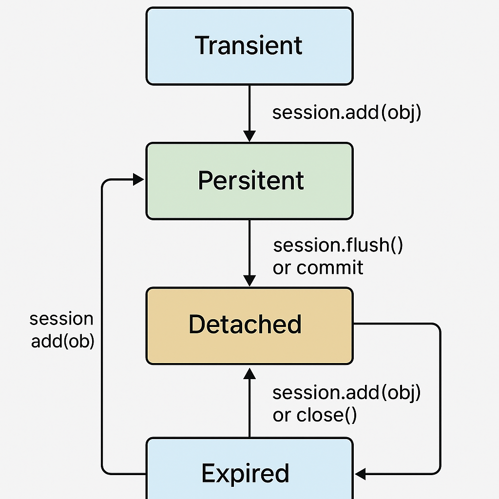

# SQL Alchemy

## Connection Pooling

A connection pool is a standard technique used to **maintain long running connections in memory** for efficient re-use, as well as to provide management for the total number of connections an application might use simultaneously.

Particularly for server-side web applications, a connection pool is the standard way to maintain a “pool” of active database connections in memory which are reused across requests.

SQLAlchemy includes several connection pool implementations which integrate with the Engine. They can also be used directly for applications that want to add pooling to an otherwise plain DBAPI approach.

## Session & Context

Session

### 🔹 What is a `Session` in SQLAlchemy?

In SQLAlchemy, a `Session` is the **central object** used to:

- Manage persistence operations (insert, update, delete).
- Track changes to objects.
- Communicate with the database.

Think of it as a **workspace** where you:

- Load objects (via queries),
- Add or modify them,
- And finally commit or rollback those changes.

### Key Responsibilities of `Session`

- Manages the identity map (ensures one object per row in memory).
- Tracks object states: transient, pending, persistent, detached.
- Bundles changes and sends them to the database in transactions.

### Example

```python
session = Session(engine)

author = Author(name="George Orwell")
session.add(author)

session.commit()  # saves the new author to the DB
```

Context

### 🔹 What is a `Context`?

In SQLAlchemy, the term **“context”** isn't a specific class or function, but rather refers to the **environment** or **execution scope** where objects are tracked and managed.
In most cases, this **context is provided by the Session**.

So, when we say an object is “in the context,” we usually mean:

- It’s being tracked by a Session,
- Its changes will be flushed and committed through that Session,
- It’s part of the identity map.

#### Technically

- There is no separate “Context” object in SQLAlchemy.
- The `Session` **is** the context — it handles object state tracking, persistence, and database interaction.

## ✅ Summary

| Concept   | Description                                                                                              |
| --------- | -------------------------------------------------------------------------------------------------------- |
| `Session` | The main SQLAlchemy object used for querying, persisting, and managing data.                             |
| `Context` | A general term meaning the environment where object states are tracked — provided by the Session itself. |

---

### 💡 Analogy

Think of the `Session` as your **open editing workspace** (like a Photoshop project file). The `Context` is everything in that workspace — the current image layers, settings, and history. But in SQLAlchemy, both ideas live inside the `Session`.

## 🔄 SQLAlchemy Session Lifecycle

The lifecycle of a SQLAlchemy `Session` typically looks like this:

```sql
1. Create a Session
   ↓
2. Add / query objects
   ↓
3. Modify objects
   ↓
4. Commit / Rollback
   ↓
5. Close session
```

```python
# 1. Create a Session
session = Session(engine)

# 2. Add or query
user = User(name="Alice")
session.add(user)

# 3. Modify
user.name = "Alice Smith"

# 4. Commit changes
session.commit()

# 5. Close session
session.close()
```

### 📦 Object States in SQLAlchemy

Each object in SQLAlchemy has one of the following **five states**:

| State          | Description                                                                                 | Example                                                         |
| -------------- | ------------------------------------------------------------------------------------------- | --------------------------------------------------------------- |
| **Transient**  | Object exists in memory but is not added to a session and has no DB identity.               | `user = User(name="Alice")` (before `session.add(user)`)        |
| **Pending**    | Object is added to the session but not yet flushed (no INSERT yet).                         | After `session.add(user)` but before `session.commit()`         |
| **Persistent** | Object is attached to the session and exists in the database.                               | After flush or commit — `user` now has a primary key            |
| **Detached**   | Object was once persistent but is no longer attached to a session.                          | After `session.expunge(user)` or `session.close()`              |
| **Expired**    | Object is persistent but its attributes will reload from the DB on next access (lazy load). | After `session.expire(user)` or `expire_on_commit=True` session |

### 🔁 State Transitions Diagram

```sql
Transient
   │
   ├─> session.add(obj)
   ↓
Pending
   │
   ├─> session.flush() or commit()
   ↓
Persistent
   │
   ├─> session.expunge(obj) or close()
   ↓
Detached
   │
   ├─> session.add(obj) — re-attaches
   ↓
Persistent again
```

### 🔍 Code Snippets for States

```python
# Transient
user = User(name="Alice")

# Pending
session.add(user)

# Persistent
session.commit()

# Detached
session.close()  # or session.expunge(user)

# Expired
session = Session(engine, expire_on_commit=True)
user = session.query(User).first()
session.commit()
user.name  # triggers a SELECT again
```

??? "SQLAlchemy Entity Lifecycle"

      

## flush & commit

### 🔹 `flush()`

- **What it does:** Sends **pending changes** (INSERT/UPDATE/DELETE) in memory to the **database**, but **does not commit** the transaction.
- **When it’s useful:** To get autogenerated values (like primary keys) before committing.

### Example

```python
session.add(user)
session.flush()  # Sends INSERT to DB, but not COMMIT

print(user.id)   # You can now access autogenerated ID

# You can still rollback at this point
session.rollback()
```

### 🔹 `commit()`

- **What it does:** Calls `flush()` **first**, then commits the current **transaction** — making all changes **permanent**.
- **When it’s used:** To finalize your changes and end the transaction.

### Example

```python
session.add(user)
session.commit()  # Does flush() + commit (can't rollback after this)
```

## ✅ Summary Table

| Operation  | Sends SQL to DB    | Saves to DB Permanently | Can Rollback After?  | Triggers Auto IDs |
| ---------- | ------------------ | ----------------------- | -------------------- | ----------------- |
| `flush()`  | ✅ Yes             | ❌ No                   | ✅ Yes               | ✅ Yes            |
| `commit()` | ✅ Yes (via flush) | ✅ Yes                  | ❌ No (after commit) | ✅ Yes            |

## Relationship

In SQLAlchemy’s ORM, `relationship()` is the function you use on your Python model classes to tell SQLAlchemy how two tables—or rather, two mapped classes—are related at the object level. Whereas `Column(ForeignKey(...))` defines the low-level, database-side foreign-key link, `relationship()` defines the high-level, object-side API that lets you navigate from one object to its related objects.

### Core Concepts

1. **Direction & Cardinality**

   - [**One-to-Many**]

     ```python
     class Parent(Base):
         __tablename__ = 'parents'
         id = Column(Integer, primary_key=True)
         children = relationship("Child", back_populates="parent")

     class Child(Base):
         __tablename__ = 'children'
         id = Column(Integer, primary_key=True)
         parent_id = Column(Integer, ForeignKey('parents.id'))
         parent = relationship("Parent", back_populates="children")
     ```

     Here, each `Parent` object has a `.children` list, and each `Child` has a `.parent` scalar.

   - [**Many-to-One**]
     Conceptually the same as one-to-many, just looked at from the child side (the scalar attribute).

   - [**One-to-One**]

     ```python
     class User(Base):
         __tablename__ = 'users'
         id = Column(Integer, primary_key=True)
         profile = relationship("Profile", uselist=False, back_populates="user")

     class Profile(Base):
         __tablename__ = 'profiles'
         id = Column(Integer, primary_key=True)
         user_id = Column(Integer, ForeignKey('users.id'), unique=True)
         user = relationship("User", back_populates="profile")
     ```

     Setting `uselist=False` tells SQLAlchemy to expect a single object rather than a list.

   - [**Many-to-Many**]

     ```python
     association = Table(
         'association', Base.metadata,
         Column('left_id', ForeignKey('left.id'), primary_key=True),
         Column('right_id', ForeignKey('right.id'), primary_key=True)
     )

     class Left(Base):
         __tablename__ = 'left'
         id = Column(Integer, primary_key=True)
         rights = relationship("Right", secondary=association, back_populates="lefts")

     class Right(Base):
         __tablename__ = 'right'
         id = Column(Integer, primary_key=True)
         lefts = relationship("Left", secondary=association, back_populates="rights")
     ```

2. **Key Parameters**

   - [**back_populates**]="attr"

     Explicitly ties two `relationship()`s together for bidirectional behavior.

   - [**backref**]="attr"

     A shortcut that automatically creates the reverse relationship on the other class.

   - [**lazy**]= loading strategy:

     - `'select'` (default): lazy loads when attribute is accessed
     - `'joined'`: eager loads via join
     - `'subquery'`: eager loads via subquery
     - `'dynamic'`: returns a query object rather than a list

   - [**cascade**]= controls what happens on session operations (e.g., delete-orphan to automatically delete children).
      - `all`: Shortcut for `save-update`, `merge`, `refresh-expire`, `expunge`,`delete`
      - `save-update`: (default) Propagate `session.add()` and object attribute changes to the child.
      - `merge`: (default) Propagate `session.merge()` to the child.
      - `refresh-expire`: Propagate `session.refresh()` and expire child objects when parent is refreshed/expired
      - `expunge`        | Propagate `session.expunge()` (removing objects from session) to the child.                                                                 |
      - `delete`         | Propagate `session.delete()` (mark for deletion) to the child.                                                                              |
      - `delete-orphan`  | If a child is de-associated from the parent (removed from collection or set to None), it is automatically deleted when the session flushes. |
      - `none`           | No cascading at all.                                                                                                                        |

3. **Usage Patterns**

   - **Navigating**

     ```python
     p = session.query(Parent).first()
     for child in p.children:
         print(child)
     ```

   - **Cascade Deletes**

     ```python
     relationship("Child", back_populates="parent",
                  cascade="all, delete-orphan")
     ```

     Removing a `Child` from `Parent.children` will delete it from the database when committed.

4. **Configuration Tips**

   - Always pair your `relationship()` with a matching `ForeignKey()` on the child side.
   - Use `back_populates` (instead of `backref`) if you want more explicit control.
   - Choose a loading strategy (`lazy`, `joined`, `subquery`, `selectin`) based on performance needs and access patterns.
   - For many-to-many, define an explicit association table unless you need association-object patterns.

### Summary

- **`ForeignKey`** = database-side constraint
- **`relationship()`** = ORM-side, lets you work with Python objects naturally
- **Key arguments**: `back_populates`/`backref`, `uselist`, `secondary`, `lazy`, `cascade`

By combining `Column(ForeignKey(...))` with the appropriate `relationship()`, you get a fully featured, bidirectional object graph that SQLAlchemy will keep in sync with your database.

<!-- links -->

[**One-to-Many**]: https://docs.sqlalchemy.org/en/20/orm/basic_relationships.html#one-to-many
[**Many-to-One**]: https://docs.sqlalchemy.org/en/20/orm/basic_relationships.html#many-to-one
[**One-to-One**]: https://docs.sqlalchemy.org/en/20/orm/basic_relationships.html#one-to-one
[**Many-to-Many**]: https://docs.sqlalchemy.org/en/20/orm/basic_relationships.html#many-to-many
[**back_populates**]: https://docs.sqlalchemy.org/en/20/orm/relationship_api.html#sqlalchemy.orm.relationship.params.back_populates
[**backref**]: https://docs.sqlalchemy.org/en/20/orm/relationship_api.html#sqlalchemy.orm.relationship.params.backref
[**lazy**]: https://docs.sqlalchemy.org/en/20/orm/relationship_api.html#sqlalchemy.orm.relationship.params.lazy
[**cascade**]: https://docs.sqlalchemy.org/en/20/orm/cascades.html
