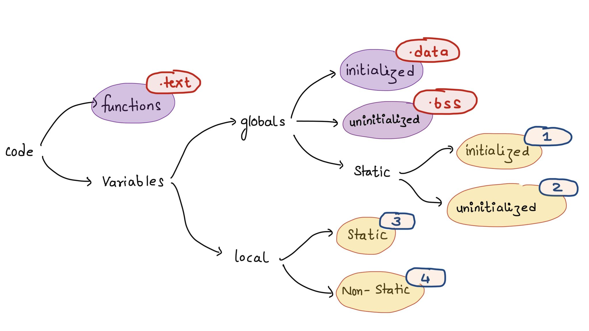

# Memory Management

## Memory Segmentation Schema

```bash
            +------------------+
            |                  |
    ⌈       |  Code Segment    |    Binary of source code
 Static     |                  |
 Memory     +------------------+
 Layout     |                  |
    ⌊       |  Data Segment    |    Static, Global variables & Constants
            |                  |
            +------------------+
            |                  |
    ⌈       |  Heap Segment    |    Dynamic variable size allocation
 Dynamic    |                  |
 Memory     +------------------+
 Layout     |                  |
    ⌊       |  Stack Segment   |    Local variables & functions
            |                  |
            +------------------+
```

## Data Segment

- Initialized (data)
- Uninitialized (bss)
- Read-Only Section
- Read-Write Section

```bash
+--------------------+
|   Code Segment     |
|                    |
|   Instructions     |
|   of the Program   |
|                    |
+--------------------+
|   Data Segment     |
|                    |
| Initialized Data   |   <-- .data section / Modifiable Data (R.W.)
| (static, globals,  |
|          e.g.)     |
| Constants          |   <-- .rodata section (or within .data)
|                    |
+ -   -   -   -   -  +
|                    |
| Uninitialized      |   <-- .bss section / Zeroed Data
|   Data (zeroed)    |
| (globals without   |
|  explicit values)  |
|                    |
+--------------------+
|                    |
|   Heap Segment     |
|                    |
|  (Dynamic Memory)  |
|                    |
+--------------------+
|   Stack Segment    |
|                    |
|   Local Variables  |
|   and Functions    |
|                    |
+--------------------+
```

## Share Memory Structure For a Thread

```bash
+--------------------+
|    ...             |
|    Code     ┑      |
|    Data  section   |
|    Heap     ┙      |
|    as same as      |
|    above           |
|    ...             |
+--------------------+
|   Stack (Thread 1) |      Share the stack segment
|                    |
|   Local Variables  |
|   and Functions    |
|                    |
+--------------------+
|   Stack (Thread 2) |
|                    |
|   Local Variables  |
|   and Functions    |
|                    |
+--------------------+
|   Stack (Thread 3) |
|                    |
|   Local Variables  |
|   and Functions    |
|                    |
+--------------------+
```

<details>
        <summary>
                Get More View
        </summary>




<!-- 

 -->

</details>

## External Resources

- [Memory Management in Operating System][MM-in-OS]
- [Memory Layout of C Programs][ML-of-C-Programs]
- [Memory Segmentation in 8086 Microprocessor][MS-in-8086-MP]
- [C Memory Division Text (code segment), Data and BSS][code-segment-data-bss]
- [Memory Management on C programming][MM-in-C]
- [Memory Layout in C][ML-in-C]

<!-- external links -->
[MM-in-OS]: https://www.geeksforgeeks.org/memory-management-in-operating-system/
[ML-of-C-Programs]: https://www.geeksforgeeks.org/memory-layout-of-c-program
[MS-in-8086-MP]: https://www.geeksforgeeks.org/memory-segmentation-8086-microprocessor
[code-segment-data-bss]: https://wahyu-ehs.medium.com/c-memory-division-text-code-segment-data-and-bss-ef7d76831d8b
[MM-in-C]: https://wahyu-ehs.medium.com/memory-management-on-c-programming-ce30135cfbcb
[ML-in-C]: https://www.javatpoint.com/memory-layout-in-c
