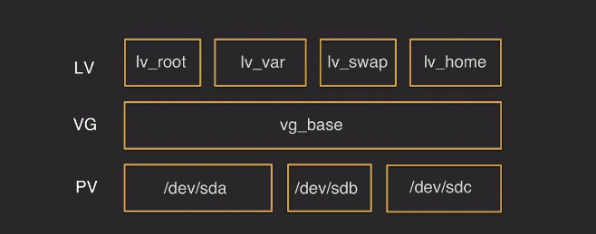
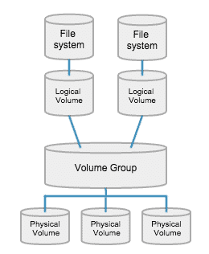

# Commands

## LVM

??? "LV/VG/PV"

    
    
    
    

### Get more info about LVM

Display and show Physical Volumes

```sh
pvs
pvdisplay [-s] <pv-name>
```

Display and show Volume Groups

```sh
vgs
vgdisplay [-s] <vg-name>
```

Display and show Logical Volume

```sh
lvs
lvdisplay <lv-name>
```

### Steps to add a physical disk or new partition to LVM

```sh
lsblk -f
df -Th
fdisk /dev/sda
F
n
l
find 8e (lvm)
t
8e (lvm)
w
mkfs.ext4 /dev/sdb[x]
pvcreate /dev/sdaX
vgextend vg-name /dev/new-partition
lvextend -L [final-partition-size] /dev/VGname
lvextend -L 99G /dev/ubuntu1804-vg/root
resize2fs /dev/vg-name/lv-name
```

### Create a new Logical Volume

Create a new Logical Volume

```sh
sudo lvcreate -n <LV name> -l <LV-size> <VG name>
sudo lvcreate -n new-lv    -l 100%FREE  vg-name
```

Make a filesystem for it

```sh
sudo mkfs.ext4 /dev/exists-vg/new-lv
```

Temporary mounting

- Mount it to wherever you want

```sh
sudo mount /dev/exists-vg/new_lv /mnt/new_dir
```

Permanent mounting

- Append this line of code to `/etc/fstab`

```sh
/dev/exists-vg/new_lv   /mnt/dir   [ext4 | btrfs]   defaults   0   2
```

### LVM snapshot

```sh
lvcreate -v -L -s -n backup /dev/vg-name
```

### write a new partition on disk

```sh
# Check the free space and partitions with mount point
lsblk
df -h

# Create a new partition on the disk
fdisk /dev/sd{a..z}
n
p / e
choice partition number
choice partition first sector
choice partition last sector
w
mkfs.ext4 /dev/sd{a..z}{1..n}
```

### Mount Option

```sh

# Show mounted partitions
fdisk -l
mount | column -t
df -h

# findmnt
findmnt -l
findmnt -D
findmnt --fstab /home

# Mount temporary
mount /dev/sd{a..z}{1..n} /xyz

# Mount permanently via fstab
1. Add new disk (usually /dev/sdb)
2. Create new partition on disk
3. Format partition with new FS (mkfs.ext4 /dev/sdb[x])
4. Mount a specific path to new partition
5. Edit `fstab` for mount permanently
```

### Get partition info

List of partitions and mounted path

```sh
lsblk
```

List of ID and UUID of devices

```sh
blkid

```

Get the list of a partition

```sh
tune2fs -l /dev/sda2

# Filesystem volume name
# Last mounted on
# Filesystem UUID
# Filesystem magic number
# Filesystem revision
# Filesystem features
```

### Change left root password

```sh
# Mount chroot shell - change password
1. Boot the Ubuntu Live CD.
2. Press Ctrl-Alt-F1
3. sudo mount /dev/sda1 /mnt
4. If you created a custom partition layout when installing Ubuntu you have to find your ‍root partition using the `fdisk -l` utility. See the section Finding your root partition.
5. sudo chroot /mnt
```

## Users and Groups

### Users

**Difference** between `useradd` and `adduser`:

`useradd` is native binary compiled with the system. But, `adduser` is a perl script which uses `useradd` binary in back-end.

`adduser` is a perl script and more user friendly and interactive than its back-end useradd. There's no difference in features provided.

`adduser` is a wrapper for `useradd`

#### Add user

```sh
# Add a new user with home directory
useradd -m mehrdad

# Add a new user with group and default shell
useradd -m mehrdad -g mehrdadgrp -s /bin/zsh

# Delete an existing user with home folder
userdel -r mehrdad

# List of users that user has already added
groups mehrdad
```

#### Changing owner

```sh
# Change owner of file
chown user_name file_name

# Change group and user owner:
chown group_name:user_name file_name

# change owner/group of a directory
sudo chown -R username:group <directory-name>
```

#### Lock and Unlock an user

```sh
# automatically
usermod -L mehrdad
usermod -U mehrdad

# manually
vim /etc/passwd
root:x:0:0:root:/root:/sbin/nologin
root:x:0:0:root:/root:/usr/sbin/nologin
```

#### Kill user in another session

```sh
ctrl + alt + f2
pkill -9 -u USER || ps -fp $(pgrep -d, -u USERNAME)
```

#### Grep all active users

```sh
sudo cat /etc/passwd | egrep "bash$"
```

#### check user exists

```sh
getent passwd root
```

### Groups

```sh
# Add a new group
grpadd

# Add an existing user to a specific group
usermod -aG grp_name user_name
gpasswd -a user_name grp_name

# Change group owner of file
chgrp group_name file_name
chown :group_name file_name
```

## Archive & Compression

### TAR

```sh
# Create TAR file
tar -cf file-name.tar file/directory

# Extract tar.xz file
tar -xf 1.tar.xz

# Extract tar.gz file
tar -xvzf 1.tar.gz

# Extract tar.bz file
tar -xvf 1.tar.bz
```

### XZ

```sh
# Add directory into the XZ compress file
tar cf - directory-name | xz -z > archive-name.tar.xz

# Create/Extract one file to XZ file
xz -z ramz.txt.gpg
xz -d ramz.txt.gpg.xz

# Create `XZ` file into the another file
xz -z ramz.txt.gpg > ramz.txt.gpg.tar.xz

# Compress existed TAR file
xz --compress images.tar
```

### GZ

```sh
# Add directory into the GZ compress file
tar cf - directory-name | gzip > archive-name.tar.gz
```

### BZIP2

```sh
# Add directory into the BZ compress file
tar cf - directory-name | bzip2 > archive-name.tar.gz
```

## systemd

- Get the list of services(units)

```sh
systemctl list-units --type=service
```

- Get the list of unit files

```sh
sudo systemctl list-unit-files --type=service
```

- Add service to startup

```sh
sudo systemctl enable <service-name>
```

- Mask service to prevent start

```sh
sudo systemctl mask <service-name>
```

- UnMask service to prevent start

```sh
sudo systemctl unmask <service-name>
```

## grep

```sh
# Reverse grep
grep -v

# count target
grep -c

# grep with line number
grep -n

# grep case insensitive
grep -i

# first line character
"^"

#end line character
"$"
or
-e
|
```

### Remove the shared line from file 1

```sh
grep -Fxv -f file2.txt file1.txt > result.txt
```

- `-F` برای استفاده از متن ساده (بدون regex)
- `-x` برای تطبیق کامل خط
- `-v` برای نمایش خط‌هایی که در فایل دوم نیستند
- `-f` file2.txt برای مقایسه با محتوای فایل دوم

## sed

### sed switch

```sh
- `s` (substitute match pattern)
- `g` (global sub)
- `3g` (after 3th character sub)
- `-e` (selected items)
- `&` (same characters)
- `-i` (save to file)
- `-r` (extended regex)
- `#line number` (each line that you want to apply sed)
- `# !` (each line that you don't want to apply sed)
- `d` (delete matched pattern)
- `-p` (print matched pattern)
- `I` (case ignore flag)
```

## comm

### Compare two sorted files line by line

Remove the sharing area from file one

```sh
comm -23 file1.txt file2.txt > result.txt
```

#### NOTE

Files must be sorted before, if didn't use this command

??? "Schema of comm 23"

    

```sh
comm -23 <(sort file1.txt) <(sort file2.txt) > result.txt
```

## dos2unix

Cat the file to see the end-of-line characters

```sh
cat -A file1.txt
```

Convert `\r\n` to `\n`

```sh
dos2unix file1.txt
```

- `\r` = Carriage Return (بازگشت هد چاپگر به ابتدای خط)
- `\n` = Line Feed (حرکت هد چاپگر به خط بعدی)

## sudoer

### force edit visudo

```sh
pkexec visudo
```

## Monitor Resources

```sh
top
htop
btop
bpytop
uptime
iotop
vmstat
iftop
```

## open ssl

Create a new CERT file via openssl

### Create a new PrivateKey

```sh
openssl [key_type [genrsa]] -out /path/to/dir/self_priv_key.key 2048
or
openssl genpkey -algorithm RSA -out /path/to/dir/self_priv_key.key 2048
```

### Create Self-Sign Cert with Private-Key

```sh
openssl req -x509 -new -days 3650 -key /path/to/dir/self_priv_key.key -out /path/to/dir/self_sing_cert.crt
```

### Open CERT file to show content

```sh
openssl x509 -in made-cert.crt -text -noout
```

### Open RSA PrivateKey file to show content

```sh
openssl rsa -in made-key.key -check
```

### Create a self-sign Kubernetes ApiServer certificate

- The private-key has been created before
- we must use kubernetes valid CA (-CA ca.crt -CAkey ca.key)

```sh
openssl req -x509 -key /etc/kubernetes/ssl/apiserver.key -out /etc/kubernetes/ssl/apiserver.crt -days 365 -CA ca.crt -CAkey ca.key -subj "/CN=kubernetes" -addext "subjectAltName=DNS:kubernetes,DNS:kubernetes.default,DNS:kubernetes.default.svc,DNS:kubernetes.default.svc.cluster.local,DNS:lb-apiserver.kubernetes.local,DNS:localhost,DNS:node1,DNS:node1.cluster.local,DNS:node2,DNS:node2.cluster.local,DNS:node3,DNS:node3.cluster.local,IP:10.233.0.1,IP:172.16.2.10,IP:192.168.1.101,IP:127.0.0.1,IP:192.168.1.102,IP:192.168.1.103,IP:192.168.1.10"
```

## curl

A ton of curl examples [is here][curl-https-request]

```sh
# download with curl
curl -C - -L -O URL

# Explain argumets
-C, --continue-at <offset>
      Continue/Resume a previous file transfer at the given offset.
-L, --location
      (HTTP) If the server reports that the requested page has moved to a different location
-O, --remote-name
      Write  output to a local file named like the remote file we get.
'-',  Read from std-in
```

## aria2

```sh
aria2c -c -s 16 -x 16 -k 1M -j 1 -i dl.txt

-c, --continue [true|false]
-s, --split=<N>
-x, --max-connection-per-server=<NUM>
-k, --min-split-size=<SIZE>
-j, --max-concurrent-downloads=<N>
-i, --input-file=<FILE>
```

## Watch the OS installation date and time

```sh
stat -c %w /
```

## Print Format Date

> date +%<format-option\>

```sh
date +"YEAR: %Y - Month: %m - Day: %d"
```

## Check for Installed Libraries

```sh
ldconfig -p | grep <libname>
```

## Set and Get from Clipboard

=== "Bash/ZSH"

    ```sh
    sudo apt install xclip
    alias pbcopy='xclip -selection clipboard'
    alias pbpaste='xclip -selection clipboard -o'
    source ~/.bashrc
    ```

=== "Fish"

    [![Sticky navigation tabs disabled]][Sticky navigation tabs disabled]

    ```sh
    sudo apt install xclip
    alias pbcopy='xclip -selection clipboard'
    alias pbpaste='xclip -selection clipboard -o'
    source ~/.config/fish/config.fish
    ```

Test bpcopy command

```sh
echo 'go to my clipboard' | pbcopy
```

??? "Watch these steps"

    ![pic5][linux-commands-cheat-sheet]

<!-- external link -->

[curl-https-request]: https://reqbin.com/req/c-lfozgltr/curl-https-request
