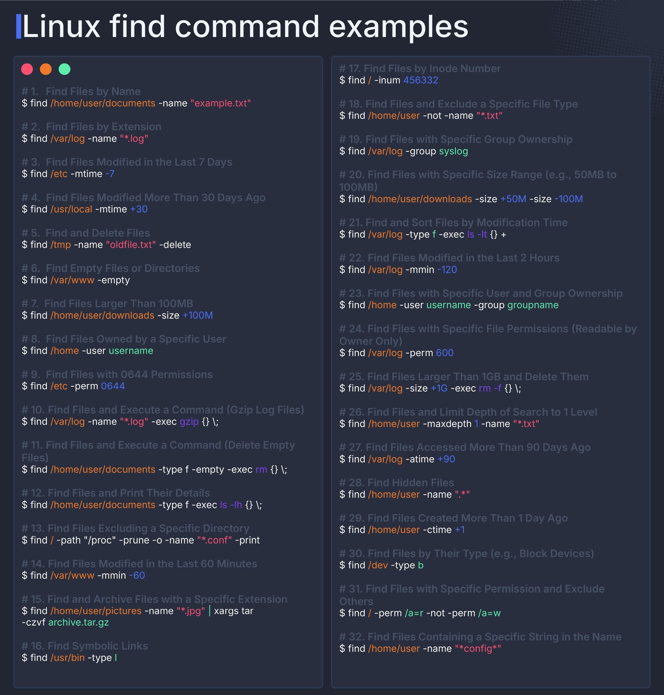

# 🔰 Find

## **_Lovely Find_** command options with examples

### 1. Find Files by Name

```sh
find /home/user/documents -name "example.txt"
```

## 2. Find Files by Extension

```sh
find /var/log -name "*.log'
```

### 3. Find Files Modified in the Last 7 Days

```sh
find /etc -mtime -7
```

### 4. Find Files Modified More Than 30 Days Ago

```sh
find /usr/local -mtime +30
```

### 5. Find and Delete Files

```sh
find /tmp -name "oldfile.txt" -delete
```

### 6. Find Empty Files or Directories

```sh
find /var/www -empty
```

### 7. Find Files Larger Than 100MB

```sh
find /home/user/downloads -size +100M
```

### 8. Find Files Owned by a Specific User

```sh
find /home -user username
```

### 9. Find Files with 0644 Permissions

```sh
find /etc -perm 0644
```

### 10. Find Files and Execute a Command (Gzip Log Files)

```sh
find /var/log -name "*.log" -exec gzip {} \;
```

### 11. Find Files and Execute a Command (Delete Empty Files)

```sh
find /home/user/documents -type f -empty -exec rm {} \;
```

### 12. Find Files and Print Their Details

```sh
find /home/user/documents -type f -exec ls -lh {} \;
```

### 13. Find Files Excluding a Specific Directory

```sh
find / -path "/proc" -prune -o -name "*.conf" -print
```

### 14. Find Files Modified in the Last 60 Minutes

```sh
find /var/www -mmin -60
```

### 15. Find and Archive Files with a Specific Extension

```sh
find /home/user/pictures -name "*. jpg" | xargs tar -czvf archive.tar.gz
```

### 16. Find Symbolic Links

```sh
find /usr/bin -type l
```

### 17. Find Files by Inode Number

```sh
find / -inum 456332
```

### 18. Find Files and Exclude a Specific File Type

```sh
find /home/user -not -name "*.txt"
```

### 19. Find Files with Specific Group Ownership

```sh
find /var/log -group syslog
```

### 20. Find Files with Specific Size Range (e.g., 50MB to 100MB)

```sh
find /home/user/downloads -size +50M -size -100M
```

### 21. Find and Sort Files by Modification Time

```sh
find /var/log -type f -exec ls -lt {} +
```

### 22. Find Files Modified in the Last 2 Hours

```sh
find /var/log -mmin -120
```

### 23. Find Files with Specific User and Group Ownership

```sh
find /home -user username -group groupname
```

### 24. Find Files with Specific File Permissions (Readable by Owner Only)

```sh
find /var/log -perm 600
```

### 25. Find Files Larger Than 1GB and Delete Them

```sh
find /var/log -size +1G -exec rm -f {} \;
```

### 26. Find Files and Limit Depth of Search to 1 Level

```sh
find /home/user -maxdepth 1 -name "*.txt"
```

### 27. Find Files Accessed More Than 90 Days Ago

```sh
find /var/log -atime +90
```

### 28. Find Hidden Files

```sh
find /home/user -name ".*"
```

### 29. Find Files Created More Than 1 Day Ago

```sh
find /home/user -ctime +1
```

### 30. Find Files by Their Type (e.g., Block Devices)

```sh
find /dev -type b
```

### 31. Find Files with Specific Permission and Exclude Others

```sh
find / -perm /a=r -not -perm /a=w
```

### 32. Find Files Containing a Specific String in the Name

```sh
find /home/user -name "*config*"
```

### 33. Find Normal Files

```sh
find /root -type f -iname pom.xml
```

### 34. Find Socket Files

```sh
find / -type s
```

### 35. Find Files by SUID (User ID)

```sh
find /usr/bin -perm -4000
```

### 36. Find Files by SGID (Group ID)

```sh
find /usr/bin -perm -2000
```

### 37. Find Sticky Files

```sh
find /usr/bin -perm -1000
```

### 38. Advanced Exclude

```sh
find -name example ! ( -name ".." -o -name "." -o -name '\\\_\\\*.sql' )
```

### 39. Rename Files Extension Recursively

```sh
find . -iname "*.yaml" -exec bash -c 'mv "$0" "${0%.yaml}.yml"' {} \;
```

**Tips**: When we mentioned `%0` in Bash, We assumed you were referring to the special variable `$0`, which is commonly used in shell scripts. In fact `%0` is a pointer to `$0` variable.

### Image of above commands

??? Toggle menu

    
