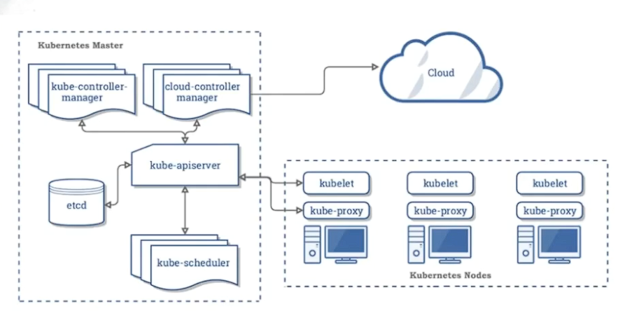

# 02. Main Components

## Kubernetes Components Architecture

kubernetes components architecture 

Kubernetes with Cloud Controller architecture 

## Deployment Tools

### Production

- [Kubeadm]
- [KOps]
- [Kube-Spray]

### Dev / Training

- [MiniKube]
- [KindD] (Kubernetes in Docker)
- [DockerDesktop]

## [Control Plane Components][cpc]

The control plane's components make global decisions about the cluster (for example, scheduling), as well as detecting and responding to cluster events (for example, starting up a new pod when a deployment's `replicas` field is unsatisfied).

### [API Server][api-server]

API Server is a common spot to integrate all kubernetes modules.

- Authentication and Authorization are here
- Validation is here
- can Mutate incoming date
- can add Admission Control (get permission or not to transaction)

### [kube-scheduler]

- Scheduler chooses the location of the deployment
- Scheduler alway talks with api-server
- It can't talk directly with etcd

### [kube-controller-manager]

- manage component "desire-state"
- monitor the cluster state via API-Server
- determine the number of nodes
- **Node controller**: For checking the cloud provider to determine if a node has been deleted in the cloud after it stops responding

- **ReplicationController**: A ReplicationController ensures that a specified number of pod replicas are running at any one time. In other words, a ReplicationController makes sure that a pod or a homogeneous set of pods is always up and available.

## [Node Components][node-comps]

Kubernetes runs your workload by placing containers into Pods to run on Nodes. A node may be a virtual or physical machine, depending on the cluster. Each node is managed by the control plane and contains the services necessary to run Pods.

Typically you have several nodes in a cluster; in a learning or resource-limited environment, you might have only one node.

The components on a node include the `kubelet`, a `container runtime`, and the `kube-proxy`.

### [kubelet]

An agent that runs on each node in the cluster. It makes sure that containers are running in a Pod.

The kubelet takes a set of PodSpecs that are provided through various mechanisms and ensures that the containers described in those PodSpecs are running and healthy. The kubelet doesn't manage containers which were not created by Kubernetes.

### [kube-proxy]

kube-proxy is a network proxy that runs on each node in your cluster, ***implementing part of the Kubernetes Service concept***.

**kube-proxy maintains network rules on nodes**. These network rules allow network communication to your Pods from network sessions inside or outside of your cluster.

kube-proxy is in charge of updating **iptables rules**

kube-proxy uses the operating system packet filtering layer if there is one and it's available. Otherwise, kube-proxy forwards the traffic itself.

### [Container runtime][cntr-rt]

The container runtime is the software that is responsible for running containers.

Kubernetes supports `container runtimes` such as `containerd`, `CRI-O`, and any other implementation of the Kubernetes `CRI` (Container Runtime Interface).

### [PODs]

The shared context of a Pod is a set of Linux `namespaces`, `cgroups`, and potentially other facets of isolation - the same things that isolate a container. Within a Pod's context, the individual applications may have further `sub-isolations` applied.

A Pod is similar to a set of containers with `shared namespaces` and `shared filesystem volumes`.

- Register Nodes
- Create PODs
- Monitor Nodes & PODs

### Key Pod Container Attributes

- name: The name of the container
- image: The container image
- ports: array of ports to expose. Can be granted a friendly name and protocol may be specified
- env: array of environment variables (environment variables)
- command: Entrypoint array (equal to Docker ENTRYPOINT)
- args: Arguments to pass to the command (equal to Docker CMD)

## APIs

### [Container v1 core][Container-v1-core]

### [API terminology][api-terms]

Kubernetes generally leverages common RESTful terminology to describe the API concepts:

- A resource type is the name used in the URL (`pods`, `namespaces`, `services`)
- All resource types have a concrete representation (their object schema) which is called a kind
- A list of instances of a resource is known as a collection
- A single instance of a resource type is called a resource, and also usually represents an object
- For some resource types, the API includes one or more sub-resources, which are represented as URI paths below the resource

## Kubernetes Components (Controller, Node) in Picture

### All Controller Components

![kube-components]

### Kube API-Server

![kube-api-server]

### Kube Scheduler

![kube-cheduler]

### Kube Control Manager

![kube-controller]
![kube-controller-components]

#### Node Controller

![node-controller]

#### Replication Controller

![replication-controller]

## Kubelet

![kubelet-1]
![kubelet-2]

## Kube Proxy

![kuber-proxy]
<!-- links -->

[Kubeadm]: https://kubernetes.io/docs/reference/setup-tools/kubeadm/
[KOps]: https://github.com/kubernetes/kops
[Kube-Spray]: https://kubespray.io/
[cpc]: https://kubernetes.io/docs/concepts/overview/components/#control-plane-components
[api-server]: https://kubernetes.io/docs/concepts/overview/components/#kube-apiserver
[kube-scheduler]: https://kubernetes.io/docs/concepts/overview/components/#kube-scheduler
[kube-controller-manager]: https://kubernetes.io/docs/concepts/overview/components/#kube-controller-manager
[node-comps]: https://kubernetes.io/docs/concepts/overview/components/#node-components
[kubelet]: https://kubernetes.io/docs/concepts/overview/components/#kubelet
[kube-proxy]: https://kubernetes.io/docs/concepts/overview/components/#kube-proxy
[cntr-rt]: https://kubernetes.io/docs/concepts/overview/components/#container-runtime
[PODs]: https://kubernetes.io/docs/concepts/workloads/pods
[Container-v1-core]: https://kubernetes.io/docs/reference/generated/kubernetes-api/v1.27/#container-v1-core
[api-terms]: https://kubernetes.io/docs/reference/using-api/api-concepts/#standard-api-terminology
[MiniKube]: https://minikube.sigs.k8s.io/docs/start/?arch=%2Fwindows%2Fx86-64%2Fstable%2F.exe+download
[KindD]: https://kind.sigs.k8s.io/
[DockerDesktop]: https://docs.docker.com/desktop/kubernetes/

[kube-components]: ../../../assets/kuber/babaei/S02-kube-components.png
[kube-api-server]: ../../../assets/kuber/babaei/S02-kube-components-api-server.png
[kube-cheduler]: ../../../assets/kuber/babaei/S02-kube-components-schedular.png
[kube-controller]: ../../../assets/kuber/babaei/S02-kube-components-control-manager.png
[node-controller]: ../../../assets/kuber/babaei/S02-kube-components-node-controller.png
[replication-controller]: ../../../assets/kuber/babaei/S02-kube-components-replication-controller.png
[kube-controller-components]: ../../../assets/kuber/babaei/S02-kube-components-control-manager-components.png
[kubelet-1]: ../../../assets/kuber/babaei/S02-kube-components-kubelet-1.png
[kubelet-2]: ../../../assets/kuber/babaei/S02-kube-components-kubelet-2.png
[kuber-proxy]: ../../../assets/kuber/babaei/S02-kube-components-kube-proxy.png
