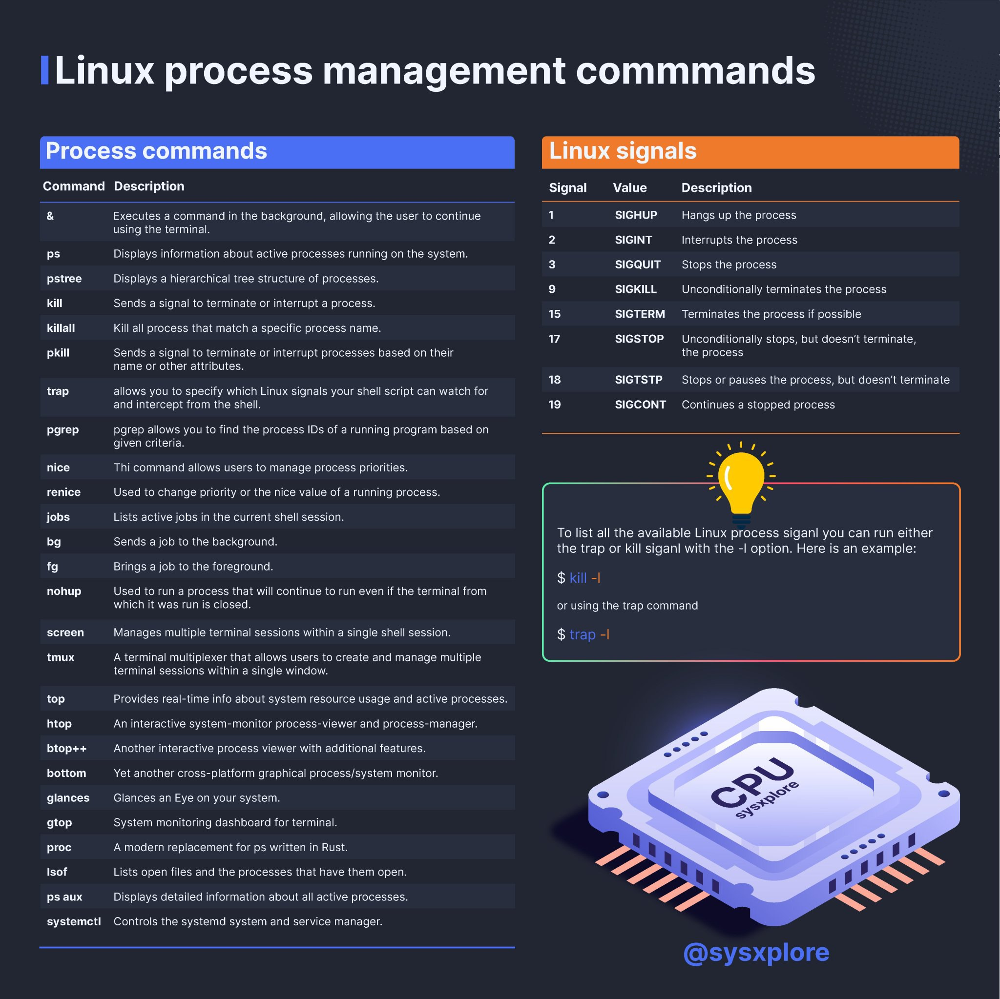

# Process Commands

## Boot Process

🟢 BIOS/UEFI runs first - checking your hardware, running the power-on self-test (POST).

🟢 Devices are detected and the system picks a boot device.

🟢 GRUB or another bootloader takes over - deciding which kernel to boot.

🟢 The kernel loads and starts mounting filesystems.

🟢 Systemd takes control - handling processes, services, and targets.

🟢 Finally, you get to the login screen.

[](../../../assets/gnu_linux/boot_process.gif)

<h4>
  <details>
    <summary>
      Watch these steps
    </summary>
    
  </details>
<h4/>

## Commands

### **Process Management Commands**

1. **`ps`**

   - Displays information about active processes.
   - Example: `ps aux` (shows all running processes with detailed information).

2. **`top`**

   - Provides a real-time view of running processes and system resource usage (CPU, memory, etc.).
   - Press `q` to exit.

3. **`htop`**

   - An interactive process viewer similar to `top`, but with a more user-friendly interface (requires installation on some systems).
   - Example: `htop`.

4. **`pidof`**

   - Finds the process ID (PID) of a running program.
   - Example: `pidof sshd` (returns the PID of the SSH daemon).

5. **`kill`**

   - Sends a signal to a process, typically to terminate it.
   - Example: `kill 1234` (sends a termination signal to the process with PID 1234).

6. **`pkill`**

   - Terminates processes based on their name or other attributes.
   - Example: `pkill firefox` (kills all Firefox processes).

7. **`killall`**

   - Kills all processes with a specified name.
   - Example: `killall chrome` (terminates all Chrome processes).

8. **`nice`**

   - Starts a process with a modified scheduling priority (lower priority means less CPU time).
   - Example: `nice -n 10 command` (runs `command` with a priority of 10).

9. **`renice`**

   - Changes the priority of a running process.
   - Example: `renice 5 1234` (changes the priority of process 1234 to 5).

10. **`bg`**

    - Puts a paused (suspended) process into the background.
    - Example: After pressing `Ctrl+Z` to pause a process, type `bg` to resume it in the background.

11. **`fg`**

    - Brings a background process to the foreground.
    - Example: `fg` (brings the most recent background process to the foreground).

12. **`jobs`**

    - Lists all jobs (processes) running in the current shell session.
    - Example: `jobs` (displays a list of background/foreground jobs).

13. **`nohup`**

    - Runs a command immune to hangups, allowing it to continue running after the user logs out.
    - Example: `nohup command > output.log &` (runs `command` and redirects output to `output.log`).

14. **`disown`**

    - Removes a job from the shell's job table, so it won't be terminated when the shell exits.
    - Example: `disown %1` (removes job 1 from the job table).

15. **`systemctl`**

    - Manages system services and processes (part of systemd).
    - Example: `systemctl status sshd` (checks the status of the SSH service).

16. **`service`**

    - Controls system services (legacy command, replaced by `systemctl` in many systems).
    - Example: `service apache2 start` (starts the Apache web server).

17. **`pgrep`**

    - Searches for processes by name or other attributes and returns their PIDs.
    - Example: `pgrep httpd` (finds the PID of the HTTP daemon).

18. **`strace`**

    - Traces system calls and signals made by a process, useful for debugging.
    - Example: `strace ls` (traces the system calls made by the `ls` command).

19. **`lsof`**

    - Lists open files and the processes that are using them.
    - Example: `lsof -i :80` (lists processes using port 80).

20. **`free`**

    - Displays the amount of free and used memory in the system.
    - Example: `free -h` (shows memory usage in human-readable format).

21. **`df`**

    - Reports file system disk space usage.
    - Example: `df -h` (shows disk usage in human-readable format).

22. **`uptime`**

    - Shows how long the system has been running.
    - Example: `uptime` (displays the system's uptime and load average).

23. **`w`**

    - Displays logged-in users and what they are doing.
    - Example: `w` (shows who is logged in and their active processes).

24. **`who`**

    - Lists currently logged-in users.
    - Example: `who` (displays usernames and login times).

25. **`id`**
    - Displays the user and group IDs of the current user.
    - Example: `id` (shows UID, GID, and groups for the current user).

<h3>
  <details>
    <summary>
      Watch More
    </summary>
    
  </details>
<h3/>

### **Description**

The `ps` (Process Status) command in Linux is used to display information about active processes on the system. It provides a snapshot of the current processes running on the system, including their IDs, states, resource usage, and more.

Here’s a detailed explanation of commonly used `ps` command options:

### **Basic Syntax**

```bash
ps [options]
```

### **Common Options**

1. **`ps aux`**

   - Displays all processes running on the system with detailed information.
   - **Explanation of flags:**
     - `a`: Shows processes for all users (not just the current user).
     - `u`: Displays the process's user/owner.
     - `x`: Includes processes not attached to a terminal.

2. **`ps -e`**

   - Lists all processes currently running on the system.
   - **Explanation:**
     - `-e`: Equivalent to `ps aux`, but without detailed information.

3. **`ps -ef`**

   - Displays all processes in a full-format listing.
   - **Explanation:**
     - `-e`: Selects all processes.
     - `-f`: Full format output, showing more details like UID, PID, PPID, etc.

4. **`ps -l`**

   - Displays processes in a long format.
   - **Explanation:**
     - `-l`: Long format, which includes additional columns such as F (flags), S (process state), and NLWP (number of threads).

5. **`ps -u <username>`**

   - Displays processes owned by a specific user.
   - **Example:**

   ```bash
   ps -u john
   ```

   - This will list all processes owned by the user `john`.

6. **`ps -p <PID>`**

   - Displays information about a specific process by its Process ID (PID).
   - **Example:**

   ```bash
   ps -p 1234
   ```

   - This will show details about the process with PID `1234`.

7. **`ps -C <command>`**

   - Displays processes associated with a specific command name.
   - **Example:**

   ```bash
   ps -C sshd
   ```

   - This will list all processes related to the `sshd` command.

8. **`ps -T`**

   - Displays all processes associated with the current terminal session.
   - **Example:**

   ```bash
   ps -T
   ```

9. **`ps -o`**

   - Allows you to customize the output fields.
   - **Example:**

   ```bash
   ps -eo pid,ppid,cmd,%mem,%cpu
   ```

   - This will display the PID, parent PID (PPID), command, memory usage (%MEM), and CPU usage (%CPU) for all processes.

10. **`ps -H`**

    - Displays processes in a hierarchical tree format.
    - **Example:**

    ```bash
    ps -eH
    ```

    - This will show all processes in a tree-like structure, making it easier to see parent-child relationships.

11. **`ps -A`**

    - Displays all processes, similar to `ps -e`.
    - **Example:**

    ```bash
    ps -A
    ```

12. **`ps -f`**

    - Displays processes in a full-format listing.
    - **Example:**

    ```bash
    ps -f
    ```

    - This will include additional columns such as UID, PID, PPID, C (CPU usage), STIME (start time), TTY, TIME, and CMD.

13. **`ps -U <user>`**

    - Displays processes owned by a specific user or group.
    - **Example:**

    ```bash
    ps -U root
    ```

    - This will list all processes owned by the `root` user.

14. **`ps -t <tty>`**

    - Displays processes associated with a specific terminal.
    - **Example:**

    ```bash
    ps -t pts/0
    ```

    - This will list all processes running on the terminal `pts/0`.

15. **`ps -L`**

    - Displays thread information for each process.
    - **Example:**

    ```bash
    ps -L
    ```

### **Output Columns Explained**

When using `ps aux` or `ps -ef`, the output typically includes the following columns:

- **USER**: The owner of the process.
- **PID**: The Process ID.
- **%CPU**: The percentage of CPU resources used by the process.
- **%MEM**: The percentage of memory resources used by the process.
- **VSZ**: Virtual memory size (in kilobytes).
- **RSS**: Resident Set Size (physical memory used by the process).
- **TTY**: The controlling terminal for the process.
- **STAT**: Process state (e.g., R = running, S = sleeping, Z = zombie).
- **START**: When the process started.
- **TIME**: Cumulative CPU time used by the process.
- **COMMAND**: The command that started the process.

### **Examples**

1. **List all processes with detailed information:**

   ```bash
   ps aux
   ```

2. **Find processes owned by a specific user:**

   ```bash
   ps -u john
   ```

3. **Display only specific fields (e.g., PID, command, memory, and CPU usage):**

   ```bash
   ps -eo pid,cmd,%mem,%cpu
   ```

4. **Show processes in a hierarchical tree format:**

   ```bash
   ps -eH
   ```

5. **Search for a specific process by name:**

   ```bash
   ps -C sshd
   ```

6. **Check the status of a specific process by PID:**

   ```bash
   ps -p 1234
   ```

By combining these options, you can tailor the output of the `ps` command to suit your needs, whether you're monitoring system performance, debugging issues, or managing processes.
