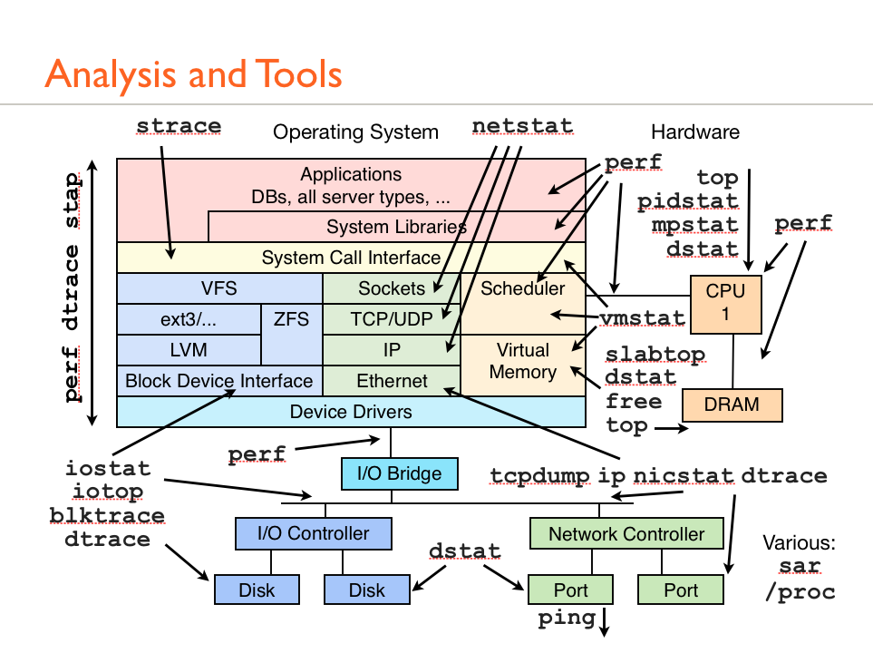

# Network Stack

The Kernel NET stack, also known as the **Linux network stack**, is the part of the Linux kernel responsible for handling all network-related functionality. It is a crucial component of the operating system, as it enables communication between the system and external networks.

The Kernel NET stack consists of several key components:

1. **Network Protocols**:

   - The network stack implements various network protocols, such as TCP/IP, UDP, ICMP, and others.
   - These protocols define the rules and standards for how data is transmitted over the network.
   - The stack provides an interface for higher-level applications to interact with these protocols.

2. **Network Devices**:

   - The network stack manages the network interface cards (NICs) and other network hardware.
   - It provides a consistent interface for applications to interact with the network devices, abstracting away the underlying hardware details.
   - The stack is responsible for configuring and controlling the network devices, such as setting IP addresses, enabling/disabling interfaces, and more.

3. **Packet Routing**:

   - The network stack is responsible for routing network packets between different network interfaces and devices.
   - It maintains routing tables and uses various routing algorithms to determine the best path for data to reach its destination.
   - The routing subsystem ensures that network traffic is properly forwarded and delivered to the correct destination.

4. **Network Security**:

   - The network stack includes features for network security, such as firewalling, packet filtering, and network address translation (NAT).
   - These security mechanisms help protect the system from network-based attacks and ensure the integrity of network communication.

5. **Socket Interface**:

   - The network stack provides a standard socket interface for applications to send and receive network data.
   - This interface allows applications to create, configure, and use network sockets for communication, abstracting away the low-level details of the network protocols.

6. **Network Namespaces**:
   - The network stack supports network namespaces, which allow for the creation of isolated network environments within a single Linux system.
   - Network namespaces provide a way to partition network resources, such as network interfaces, routing tables, and firewall rules, to create independent network stacks for different applications or containers.

### Simple Kernel Network Schema

