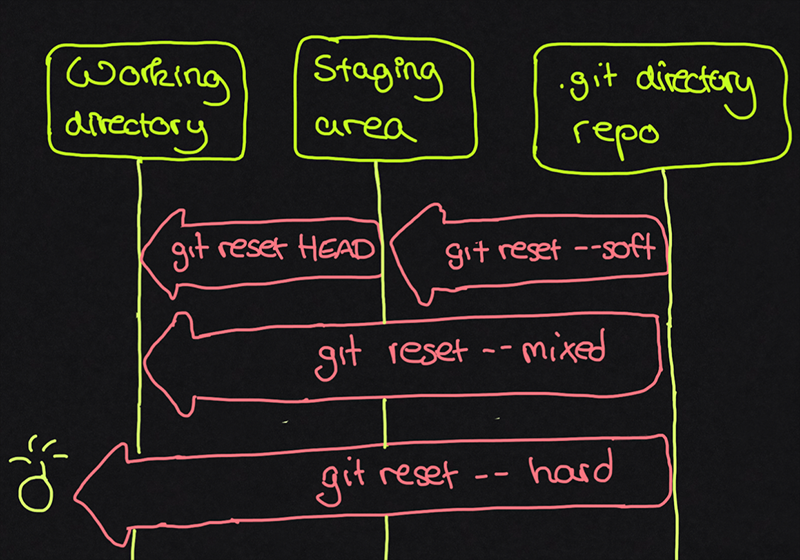
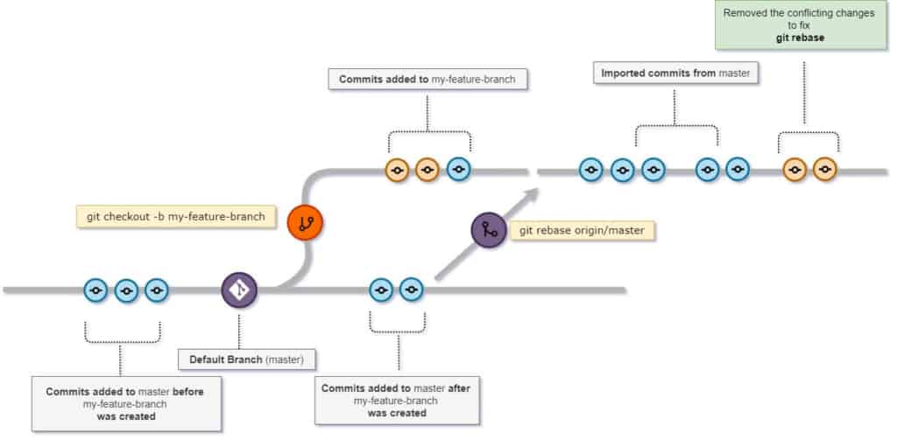
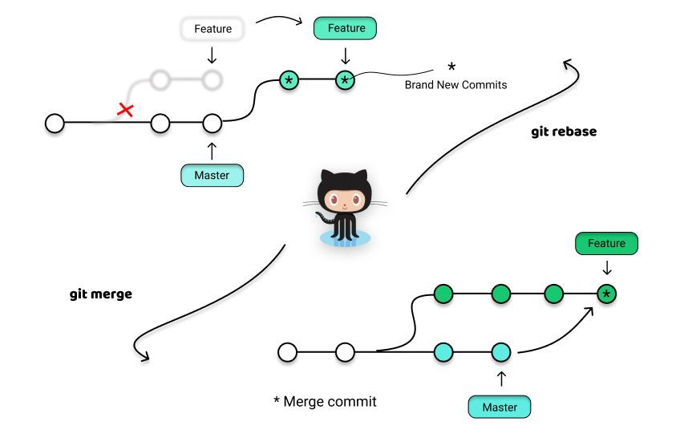
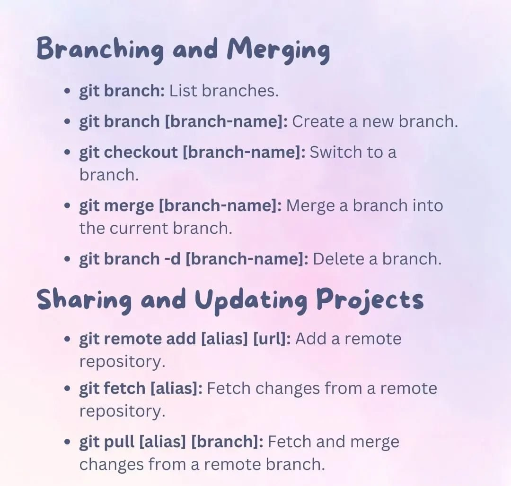
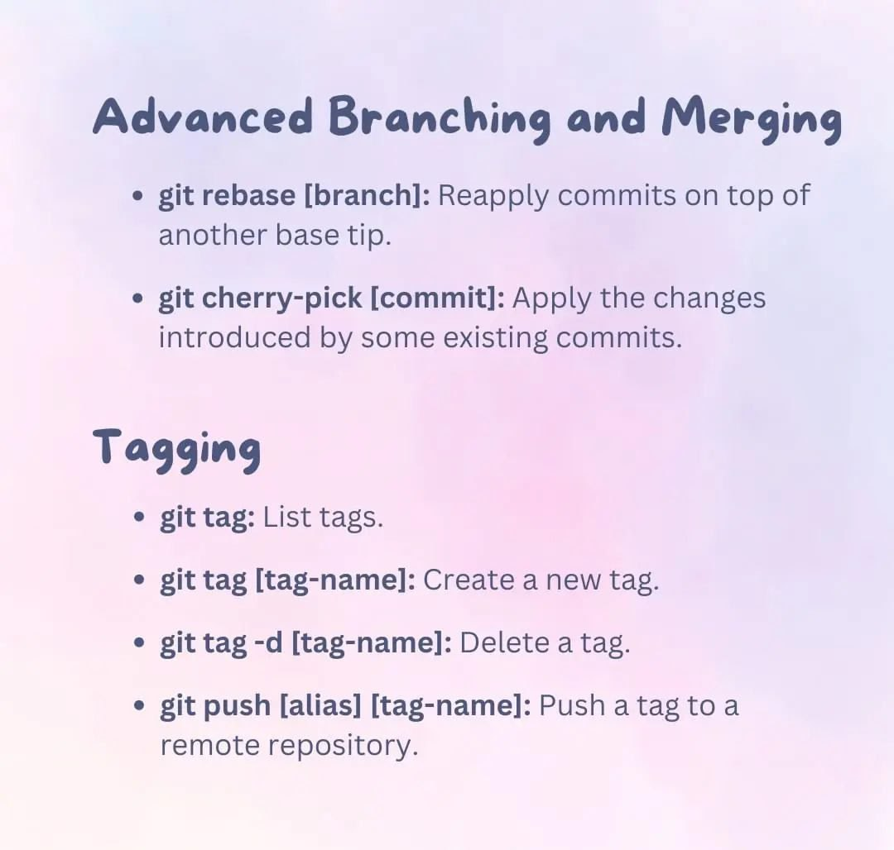
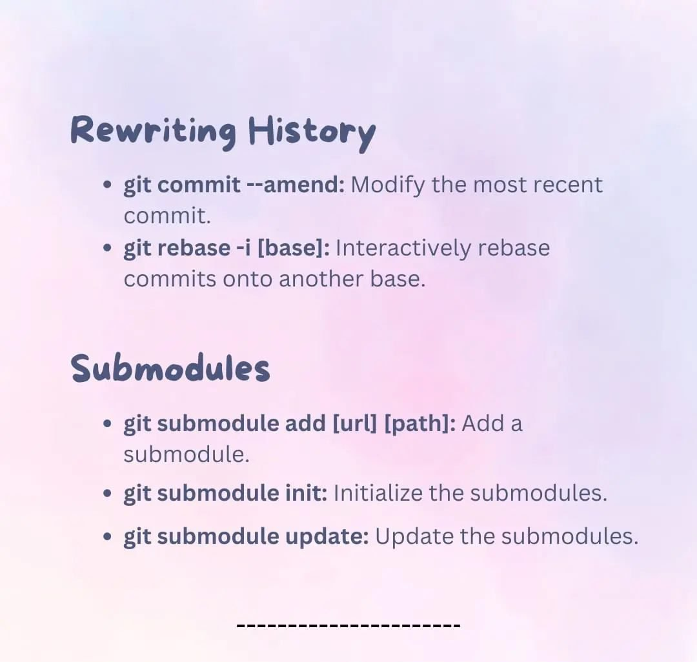
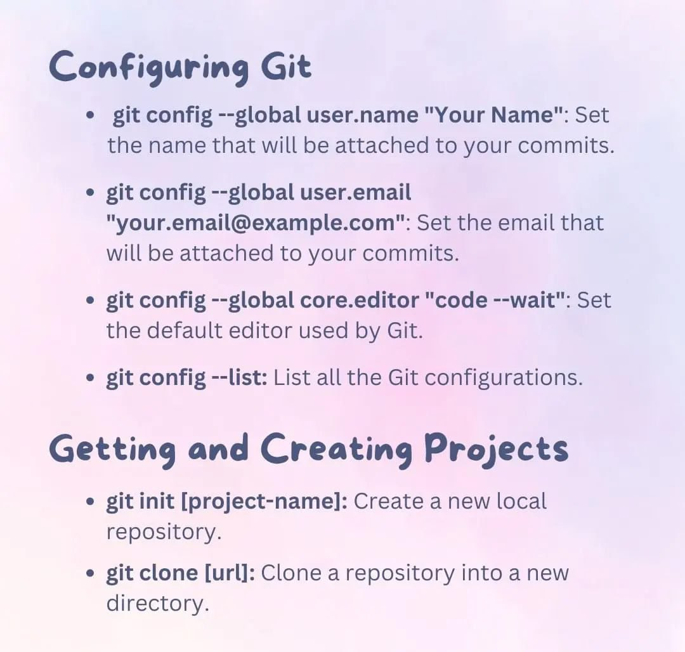
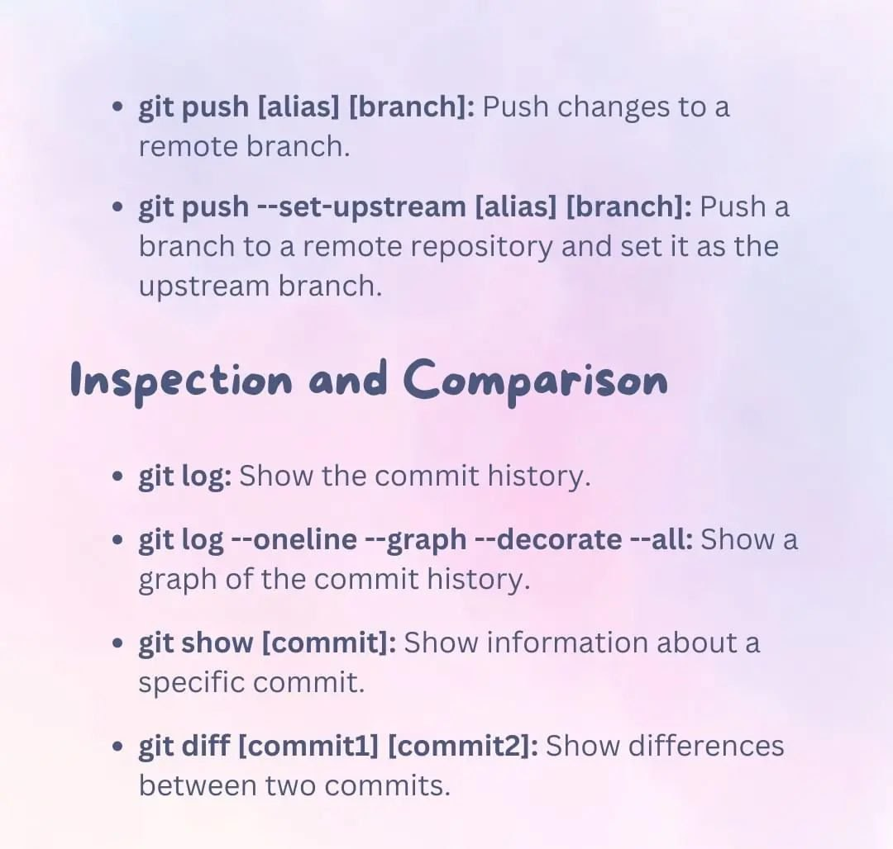
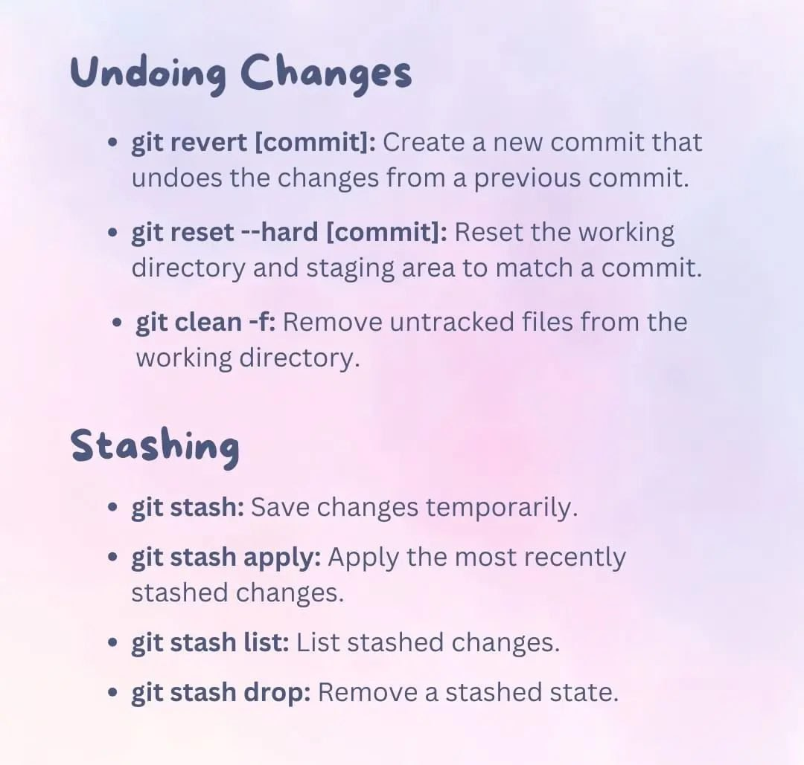
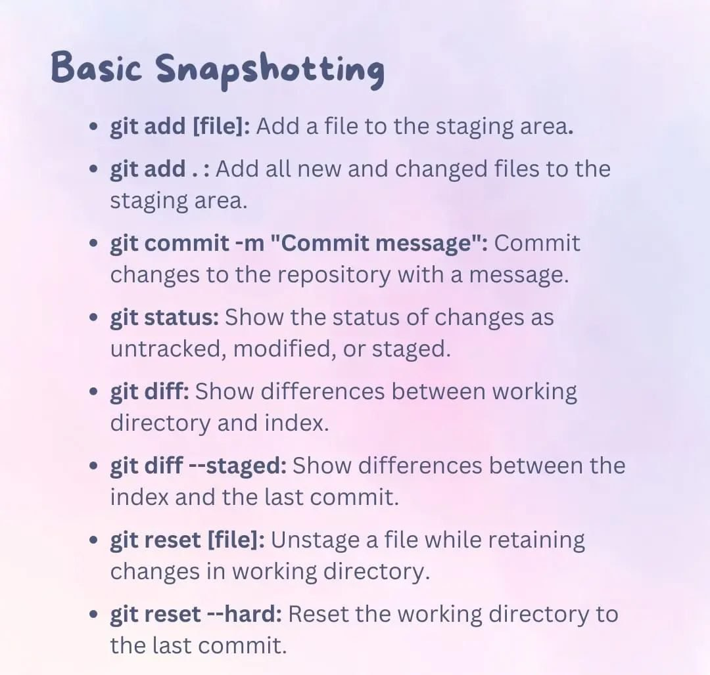

# Git

## Git Configuration

### git config

Exclude files permission from all local changes

```bash
global: git config --global core.fileMode false
local:  git config core.fileMode false
```

Update git config

```bash
git config --unset core.bare
```

Change git default editor

```bash
git config --global core.editor "vim"
```

### Skip SSL C.A

Skip unable to access `https://your.host/your-git/your-repor.git/` SSL certificate problem: self signed certificate

```bash
git config --global http.sslVerify false
```

### Specified Keys

Add github to your hosts `~/.ssh/config`

```shell
Host github
  HostName github.com
  IdentityFile ~/.ssh/id_rsa_home
```

### store username pass

```bash
git config --global credential.helper store
```

## Git Commands

### Git 3 level concept

??? git three level concept

    
    
    

### git fetch

??? "git fetch/pull"

    

### git add

Add file to stage except one

```bash
git add --all -- :!main/dont_check_main.txt
git add -- . :!main/dont_check_main.txt
```

Add a new line at EOF

```bash
git add --renormalize <file-name>
```

### git clone

Clone and checkout simultaneously

```bash
git clone -b <branch name> address
```

Clone repo

```bash
git clone --mirror git@github.com/fernandoaleman/app.git app/.git
```

### git log

Git log arguments

```bash
git log --pretty=oneline
git log --pretty=format:"%h - %an, %ar : %s"
git log --max-count 3
git log --oneline --max-count 5
git log --since="3 days ago"; (--since, --after, --until, --before)
git log --graph --oneline --decorate --all
```

### git checkout

Checkout master branch

```bash
git checkout master
```

Create new branch and switch to it

```bash
git checkout -b <New_Branch>
```

Checkout via origin branch

```bash
git branch -a
git checkout -b <branch-name> origin/<branch-name>
```

Checkout over tag number

```bash
git checkout tags/4.3.87
```

Check it up

```bash
git branch
```

Go to last 3 commit

```bash
git checkout HEAD~3
```

### git remote

Add new remote repository

```bash
git remote add origin https://github.com/username/git-project-repo.git
git remote add origin git@github.com:username/git-project-repo.git
```

Rename an existing repo

```bash
git remote rename <old-name> <new-name>
```

Get the list of the remote repository

```bash
git remote -v
```

### git branch

Create new branch

```bash
git branch <new-branch>
```

Rename a branch

```bash
git branch -m <old> <new>
```

Delete a branch

```bash
git branch -d <branch_name>
```

### git switch

Switch branch

```bash
git switch <existing-branch>
```

Point head to last commit

```raw
git switch -
```

### git reset - git revert

#### Git reset

=== "Soft"

    ```bash
    git reset --soft <commit-id>
    ```

=== "Mixed"

    ```bash
    git reset --mixed <commit-id>
    ```

=== "Hard"

    ```bash
    git reset --hard <commit-id>
    ```

??? "All git reset options"

    

#### Git revert

```bash
git revert <commit-id>
```

??? "git revert"

    

### git tag

```bash
git tag -a v1.0 8489c03c1 -m "version 1.0 is released"
```

### git rebase

Reapply commits on top of another base tip

```bash
git rebase master topic
```

```
Assume the following history exists and the current branch is "topic":
              A---B---C topic
            /
        D---E---F---G master

From this point, the result of either of the following commands:

    git rebase master
    git rebase master topic

would be:

                      A'--B'--C' topic
                    /
        D---E---F---G master
```

??? "Get more view of 'git rebase'"

    

Delete an old commit

```bash
git rebase --interactive <commit-hash-before-target-commit>
```

Then use keyword `drop` inside the target commit hash and save the file

```bash
git push -f origin branch-name
```

**Note**: the `-f` is a required parameter for this step

## Rebase & Merge Conflict, step by step guid

### git merge vs git rebase

??? "git merge / git rebase"

    
    

Checkout to main branch

```bash
git checkout master
```

Give it the last changes from main branch of remote repository

```bash
git pull origin master
```

Check the branches and go to target branch

```bash
git branch -a
git checkout target-branch
```

Give the last changes **from main branch of local repository**

```bash
git rebase master
```

**NOTE**: Git makes new temp branch and apply all changes to it until `git rebase --continue
Apply changes and get status then add

```bash
git status
git add .
```

Put temp branch changes to **target-branch**

```bash
git rebase --continue
```

Push to remove target-branch

```bash
git push -f origin target-branch
```

**NOTE**: You should solve the merge conflict manually by your TE or IDE if you have

## Some Important GIT Commands

??? Toggle menu

    
    
    
    
    
    
    
    
