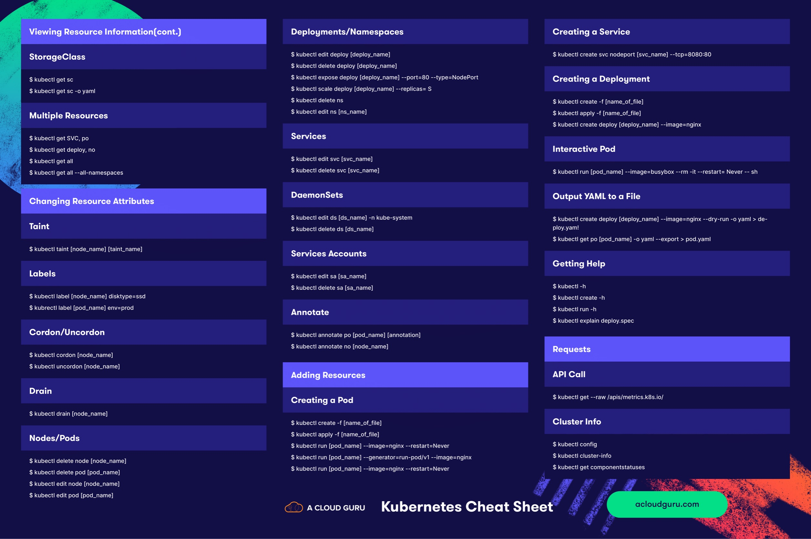
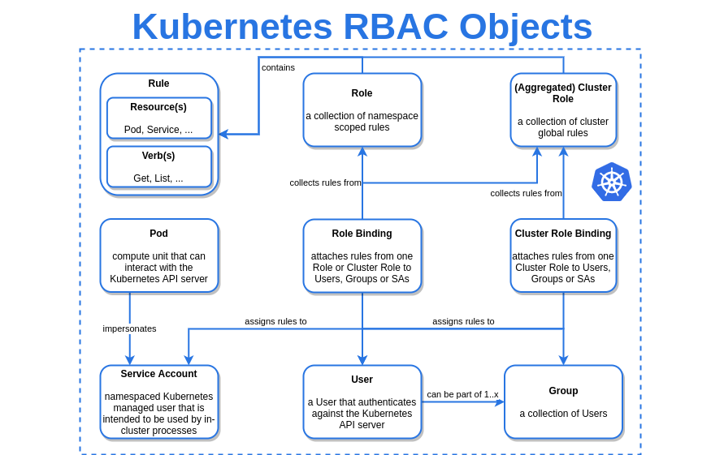

# Schema

## Visual Overview of Kubernetes Parts

### Roadmap overview

### Cheat Sheet overview

### K8S Commands overview

### Cluster overview

### RBACK Objects overview

### Debug Flowchart Diagram

