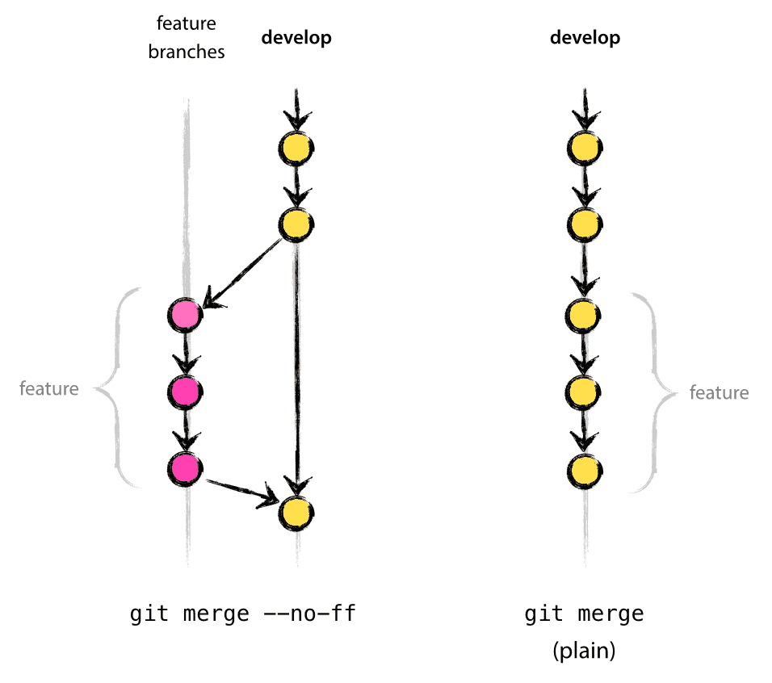
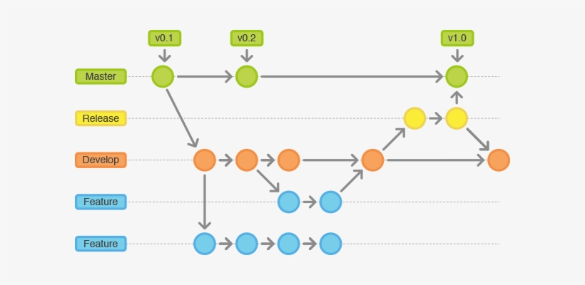

# GitFlow doc

## [Creating a feature branch](#creating-a-feature-branch)

### May branch `feature` off from

- develop

### Must `feature` merge back into

- develop

### Branch naming convention for `feature`

- feature-\*

## [Creating a release branch](#creating-a-release-branch)

### May branch `release` off from

- develop

### Must merge `release` back into

- develop and master

### Branch naming convention for `release`

- release-\*

## [Creating a Hotfix branch](#hotfix-branches)

### May branch `hotfix` off from

- master

### Must merge `hotfix` back into

- develop and master

### Branch naming convention for `hotfix`

- hotfix-\*
